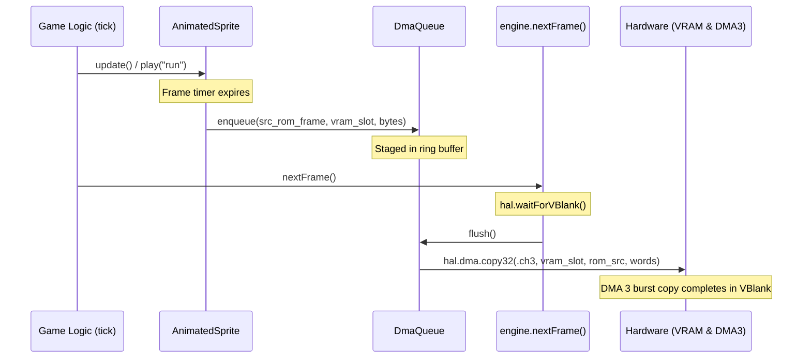

# VBlank DMA Queue & Streaming Pipeline

This document details the design, hardware constraints, and implementation of the **Fixed Ring-Buffer DMA Queue** (`src/engine/gfx2d/dma_queue.zig`) in Zamgba.

---

## 1. The Core Problem: Time-Shifted Memory Staging

In Game Boy Advance development, rendering and memory access are governed by strict hardware timing:

```
┌────────────────────────────────────────────────────────────┐
│ 1. Game Logic Phase (HDraw: Scanlines 0..159, ~11.6 ms)    │
│    - Game pad input, physics updates, animation advancement│
│    - Player switches to "jump", Boss switches to "slash"   │
│    - Writing to VRAM is STRICTLY FORBIDDEN (causes tearing)│
│    - Action: Animation entities enqueue transfer requests  │
└─────────────────────────────┬──────────────────────────────┘
                              │ Staged in DmaQueue
┌─────────────────────────────▼──────────────────────────────┐
│ 2. VBlank Phase (Scanlines 160..227, ~5.0 ms / 83,776 cyc) │
│    - engine.nextFrame() triggers during vertical blanking  │
│    - The ONLY safe window for high-speed VRAM tile writes  │
│    - Action: Engine flushes all queued tasks via DMA 3     │
└────────────────────────────────────────────────────────────┘
```

`DmaQueue` serves as the asynchronous staging buffer bridging the **Game Logic Phase** (where requests are created) and the **VBlank Phase** (where transfers physically execute).

---

## 2. Why a Fixed Ring Buffer (Circular Queue)?

1. **Zero-Heap Allocation (`.bss` Static Storage)**:
   - Allocates a static array of fixed tasks (e.g., `[16]DmaTask`, taking $< 256$ bytes).
   - Enqueue and flush operations simply manipulate integer indices (`head`, `tail`, `count`), taking only 1–2 CPU cycles per task.
2. **Multi-Entity Decoupling**:
   - Independent game objects (Player, Boss, projectile VFX) advance their animation frames in `tick()` without knowledge of each other. Each entity pushes its frame tile copy task into `DmaQueue.enqueue()`.
3. **Batch Coalescing & VBlank Flush**:
   - In `engine.nextFrame()`, the engine pulls all pending tasks and drives hardware DMA 3 in a tight loop during the vertical blanking interrupt.

---

## 3. Data Structures (`src/engine/gfx2d/dma_queue.zig`)

```zig
pub const DmaQueue = struct {
    pub const CAPACITY: usize = 16;
    pub const DEFAULT_MAX_BYTES_PER_VBLANK: usize = 4096; // 4 KB safe VBlank budget
    pub const HARDWARE_MAX_SAFE_LIMIT: usize = 16384;      // 16 KB upper physical safety limit (~20% VBlank)

    tasks: [CAPACITY]hal.dma.DmaTask = undefined,
    head: usize = 0,
    tail: usize = 0,
    count: usize = 0,
    staged_bytes: usize = 0,
    max_bytes_per_vblank: usize = DEFAULT_MAX_BYTES_PER_VBLANK,

    /// Dynamically adjust the maximum allowed VBlank transfer budget for the active scene.
    pub fn setMaxBytesPerVblank(self: *DmaQueue, bytes: usize) void;

    /// Enqueues a DMA memory transfer task.
    pub fn enqueue(self: *DmaQueue, task: hal.dma.DmaTask) DmaQueueError!void;

    /// Flushes all queued tasks via DMA 3 and resets the queue for the next frame.
    pub fn flush(self: *DmaQueue) void;

    /// Clears any pending transfers without executing them.
    pub fn clear(self: *DmaQueue) void;
};
```

---

## 4. VBlank Bandwidth Budget Guard & 4 KB Mathematical Derivation

### A. Hardware Timing & Cycle Derivation
1. **Total Frame Duration**:
   - GBA CPU runs at **16.78 MHz** (16,777,216 Hz), yielding **280,896 CPU cycles per frame** at ~59.73 FPS.
   - Each frame consists of **228 total scanlines** (160 visible active rendering lines, **68 VBlank lines**).
   - Each scanline takes **1,232 cycles**.
   - Total VBlank duration = $68 \times 1232 = \mathbf{83,776\text{ CPU cycles}}$ (~5.0 milliseconds).

2. **DMA 3 Transfer Bus Timings**:
   - Reading 32-bit words from 16-bit Game Pak ROM (with prefetch buffer) takes ~2–3 wait states.
   - Writing 32-bit words to 16-bit OBJ VRAM splits into two halfword writes taking 2 cycles.
   - Taking bus arbitration and reload cycles into account, DMA 3 throughput averages **~4 cycles per 32-bit word** (4 bytes).

3. **4 KB Budget Evaluation**:
   $$\text{Words to transfer} = \frac{4096\text{ bytes}}{4\text{ bytes/word}} = 1024\text{ words}$$
   $$\text{Transfer time} \approx 1024\text{ words} \times 4\text{ cycles/word} = \mathbf{4,096\text{ CPU cycles}}$$
   $$\text{VBlank Window Utilization} = \frac{4,096\text{ cycles}}{83,776\text{ cycles}} \approx \mathbf{4.88\%}$$

### B. Why 4 KB is the Sweet Spot
- **Substantial Safety Margin**: Consuming $< 5\%$ of the total VBlank window leaves over **95% of VBlank cycles** for other time-critical operations (Shadow OAM copy of 128 entries = ~512 cycles, scroll register updates, palette animations, audio sample buffer fills, and BIOS SWI interrupt dispatch).
- **High Animation Concurrency**: 4 KB allows:
  - **128 tiles in 4-bpp**: Simultaneously switching frames for **8 independent 16x16 characters** or **2 large 32x32 characters** in a single frame tick;
  - **64 tiles in 8-bpp**: Completely refreshing a **giant 64x64 8-bpp Boss sprite** in a single frame.
- **Overload Protection**: If staged transfers exceed `max_bytes_per_vblank`, the queue safely rejects excess transfers with `error.ExceedsVblankBudget`, preventing DMA from overrunning into scanline 0 (HDraw) and eliminating screen tearing.

### C. Dynamic Scene Budget Customization
Developers can tune the VBlank budget per scene via `setMaxBytesPerVblank()` or `engine.setDmaVblankBudget()`:
- **Default (4 KB)**: Balanced for standard gameplay with active background scrolling and audio playback.
- **Heavy Animation (up to 16 KB / `HARDWARE_MAX_SAFE_LIMIT`)**: Suitable for 1v1 fighting games, boss cutscenes, or level transitions where audio and background overhead is minimal.
- **Heavy Audio / Tile Cycling (1–2 KB)**: Enforces strict limits in scenes with intensive Direct Sound mixing and real-time palette manipulation.

---

## 5. Integration with AnimatedSprite & Engine Loop


